# Architecture Diagrams — Global Fund Data Explorer

---

## 1. Application Entry & Routing

The app boots in `src/main.tsx`, wraps the React tree with the Easy Peasy `StoreProvider` and React Router, then delegates to a declarative route config.

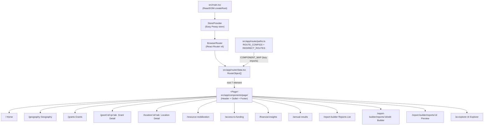

---

## 2. Global State Architecture (Easy Peasy Store)

All application state is assembled in `src/app/state/store/index.ts`. API data slices use the `APIModel` factory; UI/filter slices are plain Easy Peasy action models. Most slices are persisted to `localStorage` via Easy Peasy's `persist()` wrapper.

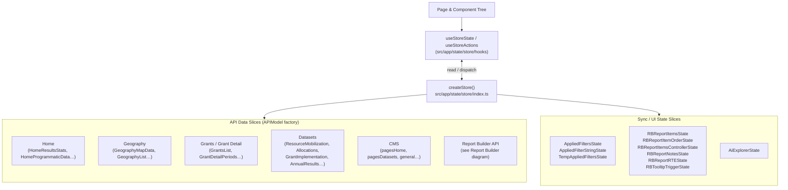

---

## 3. APIModel Factory — Data Flow

Every API slice is created with `APIModel(url)` from `src/app/state/api/index.ts`. This factory produces a standard interface used uniformly across all data slices.

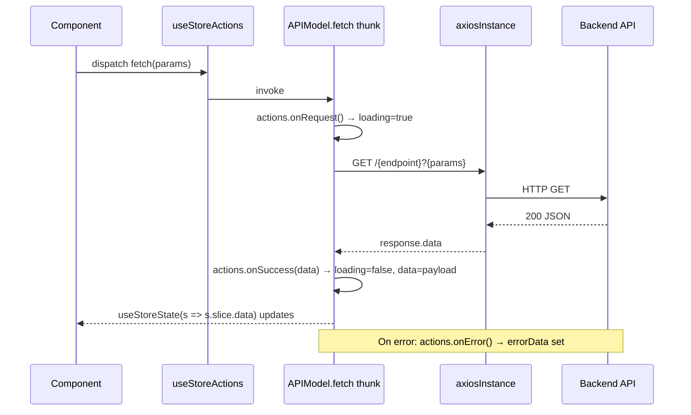

---

## 4. CMS Integration

CMS content (labels, tooltips, chart descriptions) is fetched from Strapi at app startup and stored in the Easy Peasy store.

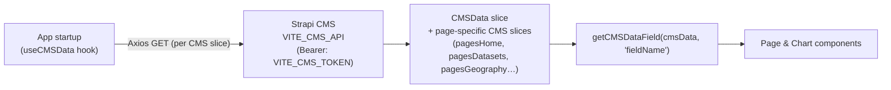

---

## 5. Filter → URL → Refetch Cycle

Applied filters are stored in Easy Peasy, serialized to URL query params, and deserialized back on page load. Any filter change triggers a data refetch.

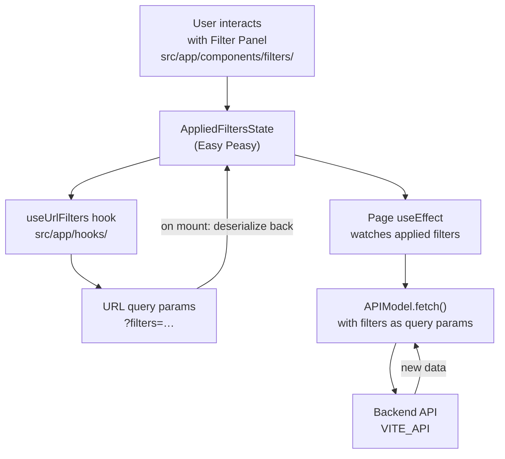

---

## 6. Chart Rendering Pipeline (Dataset Pages)

All dataset-page charts follow the same rendering chain: data fetch → ChartBlock wrapper → specific ECharts chart component.

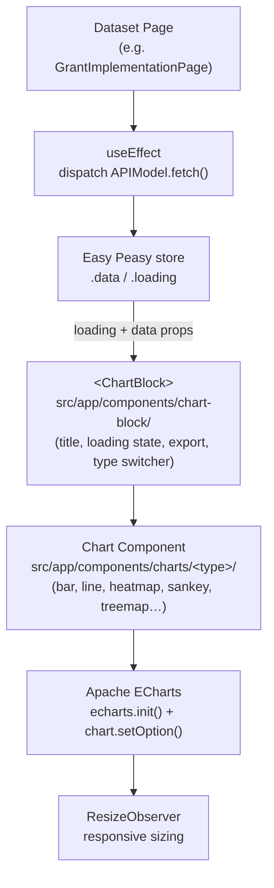

---

## 7. Report Builder — Top-Level Architecture

The report builder feature spans three pages, six Easy Peasy sync slices, and a dedicated set of TanStack Query hooks. All HTTP calls go through the same `axiosInstance` as the rest of the app.

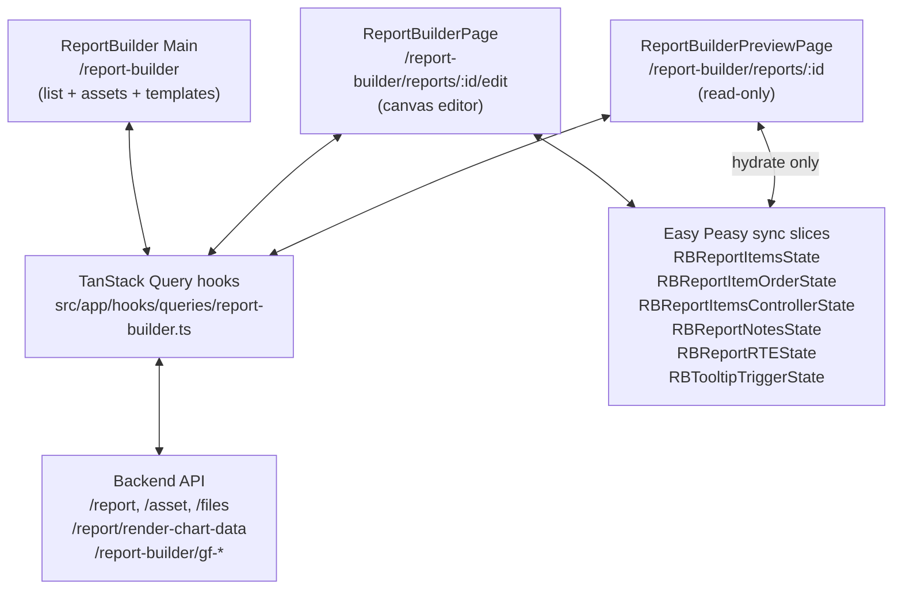

---

## 8. Report Builder — Item Lifecycle

An item (block) is created, edited via the right-hand controller panel, and persisted to the API through autosave.

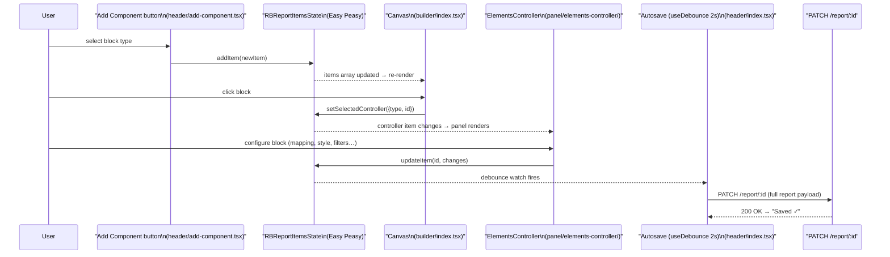

---

## 9. Report Builder — Chart Block Data Flow

When a chart block has a valid dataset + chart type + dimension mapping, it fetches rendered chart data from the API and hands the result to ECharts.

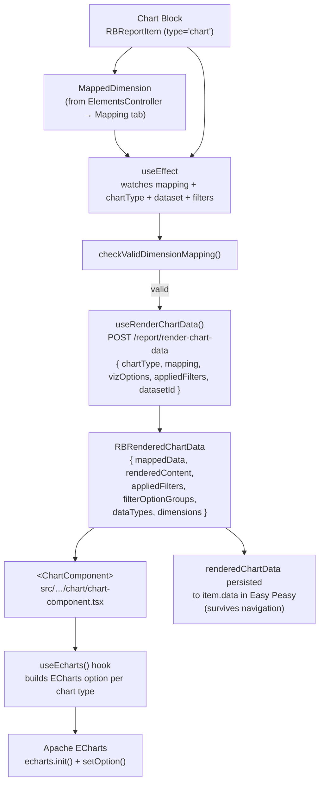

---

## 10. Report Builder — Drag-and-Drop Reordering

Item reordering on the canvas uses `react-dnd` with the HTML5 backend. Each item is wrapped in an `ItemComponent` that registers both drag and drop handlers.

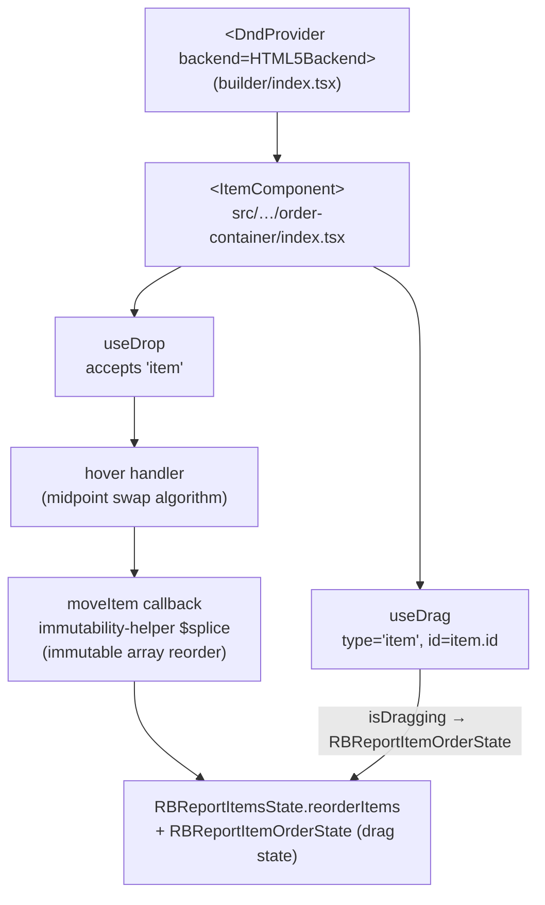

---

## 11. Report Builder — Preview vs Builder Mode

The same item components render in both modes; `viewMode` prop controls interactivity.

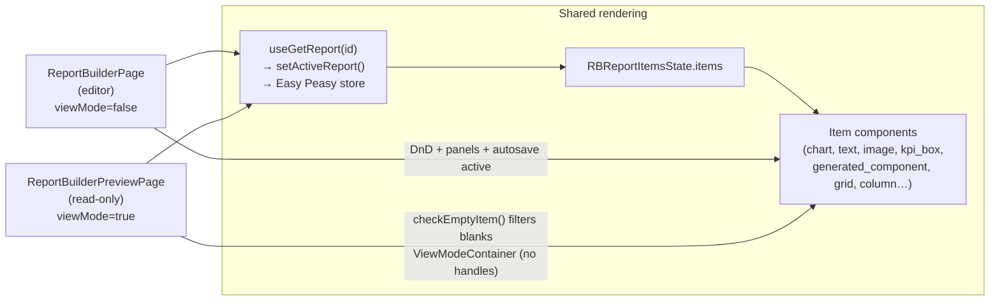
